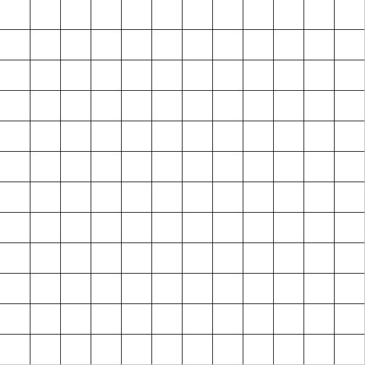
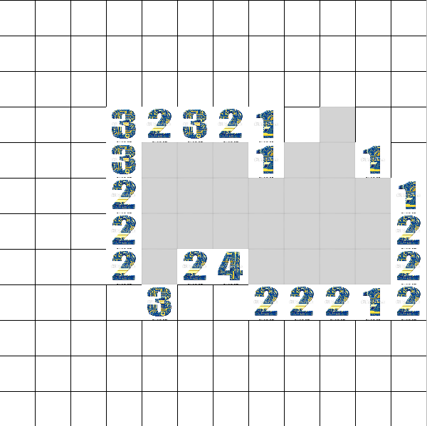
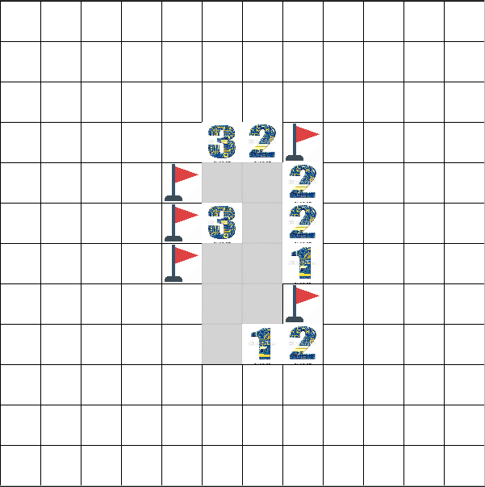
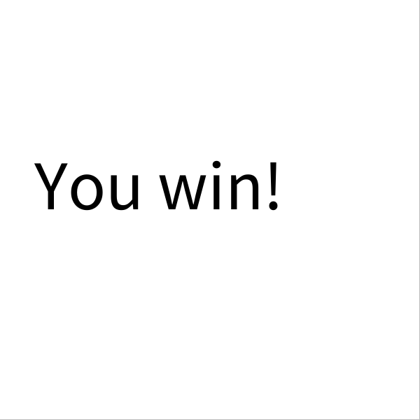
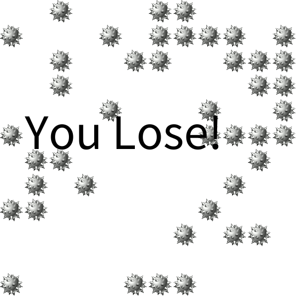

# MineSweeper

The board is divided into cells, with mines randomly distributed. To win, you need to open all the cells (left click). The number on a cell shows the number of mines adjacent to it.You can determine cells that are safe, and cells that contain mines. Cells suspected of being mines can be marked with a flag using the right mouse button.

## Initial grid

The grid where we play the game

## First click

the first click will clear up some cells and show some numbers to start playing

## Flags

placing some flags (right click) / reveal cell (left click)

## Winning a game

once you flag all the mines, you WIN!

## Losing a game

If you left click a mine (reveal the cell), you LOSE.

## About

Made by Khairi Hammami, Mahdi Said and Eya Moalla using [Processing](https://processing.org/).
